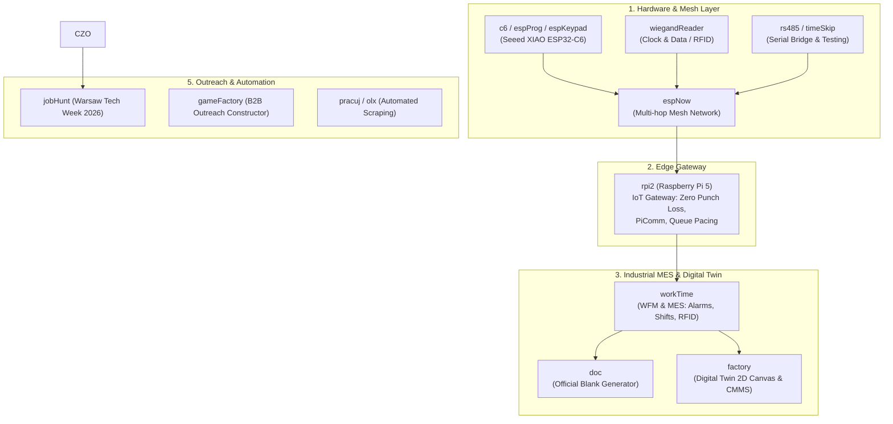

# Екосистема Проєктів Романа Дейнека (ACTIVE_PROJECTS_ECOSYSTEM.md)

> **Статус:** Актуальна інвентаризація всіх інженерних проєктів  
> **Дата оновлення:** Осінь 2026  
> **Локація проєктів:** `/Users/neko/Documents/PlatformIO/Projects/`  
> **Призначення:** Єдиний довідник та онтологія всіх діючих систем для ШІ-агентів, рекрутерів та партнерів.

---

## 🗺️ Загальна Архітектура Екосистеми

Всі 20 проєктів утворюють взаємопов'язану вертикально інтегровану екосистему: від фізичних сенсорів та мікроконтролерів (ESP32-C6 / ESP-NOW) до промислових edge-шлюзів (Raspberry Pi 5), хмарних MES-систем, цифрових двійників заводів (React 19 Canvas) та DeepTech стартапів.

---

## 🛠️ 1. Кластер: Hardware, Embedded & Mesh Networks (Апаратний рівень)

### 1.1. [`espProg`](file:///Users/neko/Documents/PlatformIO/Projects/espProg) — Багатофункціональний сенсорний mesh-вузол
- **Стек:** PlatformIO, C/C++, Arduino Core, Seeed Studio XIAO ESP32-C6 (RISC-V).
- **Призначення:** Базовий автономний вузол виробничої мережі. Підтримує підрахунок імпульсів, зчитування RFID (Wiegand/SPI), матричні клавіатури 3x3 та бездротову ретрансляцію.
- **Ключові досягнення:**
  - Реалізація багаторангової mesh-мережі на базі протоколу ESP-NOW без роутерів.
  - Бездротова прошивка **Serial OTA через UART** з динамічним керуванням чергами (`dynamic_messages_memory_management.md`).
  - Протокол **PiComm** для надійного зв'язку зі шлюзом Raspberry Pi.
  - Збереження конфігурацій та лічильників в енергонезалежній пам'яті NVS.

### 1.2. [`rpi2`](file:///Users/neko/Documents/PlatformIO/Projects/rpi2) — Промисловий IoT-шлюз на Raspberry Pi 5
- **Стек:** Python 3, asyncio, WebSockets, aiohttp, systemd.
- **Призначення:** Інтелектуальний міст між бездротовою ESP-NOW мережею та бекендом MES-системи `workTime`.
- **Ключові досягнення:**
  - **Zero Physical Punch Loss:** Гарантована доставка кожного фізичного відбитка (RFID / PIN) навіть при повній відсутності інтернету або аварії сервера (локальний Dead-Letter Queue).
  - Адаптивний пейсинг команд (Adaptive Command Pacing Queue) та семафори паралелізму WebSockets.
  - Автоматичне виявлення відкидання діагностичних пакетів та компенсація мережевих затримок.

### 1.3. [`espNow`](file:///Users/neko/Documents/PlatformIO/Projects/espNow) — Протокол та компоненти розумного дому ESP-NOW
- **Стек:** ESP-IDF, FreeRTOS, ESP32, MQTT.
- **Призначення:** Дослідницький хаб та прототип шлюзів між ESP-NOW та зовнішніми мережами MQTT/Wi-Fi (`zh_gateway-main`, `zh_espnow_switch-main`).

### 1.4. [`espKeypad`](file:///Users/neko/Documents/PlatformIO/Projects/espKeypad) — Кодонабірна панель контролю доступу
- **Стек:** PlatformIO, C/C++, Seeed XIAO ESP32-C6.
- **Призначення:** Сканування 3x3 матричної клавіатури, апаратний антибрязкіт контактів, формування PIN-подій та передача по ESP-NOW.

### 1.5. [`wiegandReader`](file:///Users/neko/Documents/PlatformIO/Projects/wiegandReader) — Перехоплювач та ретранслятор Clock & Data / Wiegand
- **Стек:** PlatformIO, C/C++, Seeed XIAO ESP32-C6.
- **Призначення:** Прозорий ретранслятор і декодер між промисловими RFID-зчитувачами формату Clock & Data / Wiegand та контролерами СКУД.

### 1.6. [`rs485`](file:///Users/neko/Documents/PlatformIO/Projects/rs485) — USB-to-UART / RS485 серійний міст
- **Стек:** PlatformIO, C/C++, Seeed XIAO ESP32-C6.
- **Призначення:** Апаратний міст між ПК/USB-хостом та промисловою шиною RS485 для налагодження та телеметрії.

### 1.7. [`timeSkip`](file:///Users/neko/Documents/PlatformIO/Projects/timeSkip) — Емулятор та тестер сигналів обліку часу
- **Стек:** PlatformIO, Arduino, Seeed XIAO ESP32-C6.
- **Призначення:** Генератор та інжектор тестових імпульсів для валідації надійності ліній обліку робочого часу.

### 1.8. [`c6`](file:///Users/neko/Documents/PlatformIO/Projects/c6) — Базовий шаблон для RISC-V ESP32-C6
- **Стек:** PlatformIO, `pioarduino/platform-espressif32`.
- **Призначення:** Чистий еталонний темплейт для нових периферійних модулів.

---

## 🏭 2. Кластер: Industrial MES & Digital Twin (Індустрія 4.0)

### 2.1. [`workTime`](file:///Users/neko/Documents/PlatformIO/Projects/workTime) — Корпоративна WFM та MES система
- **Стек:** Next.js 15, React 19, TypeScript, Tailwind CSS, REST API.
- **Призначення:** Комплексна система обліку робочого часу, диспетчеризації змін та контролю виробничого периметра.
- **Ключові досягнення:**
  - Обробка десятків тисяч свайпів без втрат, автоматичне зіставлення карт та табелів.
  - Движок тривог (Alarm Engine): відстеження запізнень, невідмічених виходів, порушень периметра.
  - Кабінет лідера зміни (Leader Login) з можливістю ручного вирішення інцидентів та перегляду телеметрії.

### 2.2. [`factory`](file:///Users/neko/Documents/PlatformIO/Projects/factory) — Factory Digital Twin Canvas & CMMS
- **Стек:** React 19, TypeScript, Custom HTML5 Canvas Engine (без сторонніх бібліотек), FastAPI (Python 3) + SQLite.
- **Призначення:** Цифровий двійник заводу в реальному часі. Інтерактивна 2D-карта цеху, планування планово-попереджувальних ремонтів (CMMS) та моніторинг стану верстатів.
- **Ключові досягнення:**
  - Власний векторний рушій Canvas: плавний рендеринг, масштабування, підтримка тач-скрінів та мобільних пристроїв.
  - Розумне авто-згортання бічних панелей (Auto-Tuck) на екранах `<1300px`.
  - Повна інтеграція з базою верстатів та графіками обслуговування.

### 2.3. [`doc`](file:///Users/neko/Documents/PlatformIO/Projects/doc) — Генератор офіційних виробничих бланків
- **Стек:** HTML5, CSS3 (Glassmorphism), Vanilla JS.

## 💼 4. Кластер: B2B Outreach, Career & Automation (Кар'єра та Продажі)

### 4.1. [`jobHunt`](file:///Users/neko/Documents/PlatformIO/Projects/jobHunt) — Warsaw Tech Week 2026 Offensive
- **Суть:** Стратегічний спринт для офлайн-нетворкінгу та презентації компетенцій Full-Stack / Embedded Architect на чотирьох виставках Ptak Warsaw Expo.

### 4.2. [`gameFactory`](file:///Users/neko/Documents/PlatformIO/Projects/gameFactory) — B2B Outreach Конструктор
- **Суть:** Модульна Markdown-система ("Lego-конструктор") для генерації високоточних персоналізованих B2B-пропозицій для заводів і фабрик у радіусі 100 км.

### 4.3. [`pracuj`](file:///Users/neko/Documents/PlatformIO/Projects/pracuj) — Автоматизований парсер вакансій
- **Стек:** Python, FastAPI, `nodriver` (асинхронний Chrome automation), Jinja2.
- **Суть:** Скрапер ринку праці з мок-бордом та фільтрацією релевантних інженерних пропозицій.

### 4.4. [`olx`](file:///Users/neko/Documents/PlatformIO/Projects/olx) — Скрапер оголошень OLX
- **Стек:** Python, CLI.
- **Суть:** Пошук промислового обладнання, верстатів та комплектуючих на `olx.pl`.

---

## 📱 5. Кластер: IoT & Personal Systems (Особисті та Інфраструктурні Проєкти)

### 5.1. [`familiTracker`](file:///Users/neko/Documents/PlatformIO/Projects/familiTracker) — Сімейний трекер завдань та часу
- **Стек:** FastAPI, Python 3.10+, SQLAlchemy, Pydantic v2, SQLite, Scrum/Kanban.
- **Суть:** Домашній сервіс тайм-трекінгу та розподілу обов'язків.

### 5.2. [`sleapTrack`](file:///Users/neko/Documents/PlatformIO/Projects/sleapTrack) — Трекер сну та біометрії
- **Стек:** PlatformIO, ESP32, Huawei Health API.
- **Суть:** Апаратний моніторинг фаз сну та синхронізація здоров'я.

### 5.3. [`server`](file:///Users/neko/Documents/PlatformIO/Projects/server) — Інфраструктура та діагностика VPS
- **Стек:** Bash, Python, SSH ED25519.
- **Суть:** Конфігурація віддаленого сервера `37.187.153.154` (доступ суворо регламентований правилами безпеки).
