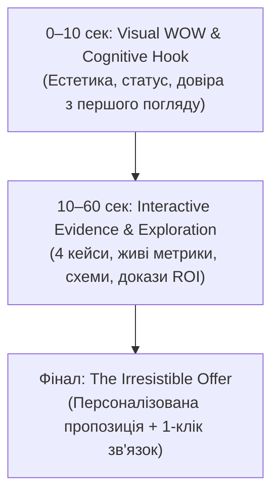

# Стратегія Конверсії та Позиціонування Портфоліо Романа Дейнека

> **Мета документа:** Визначити чіткий шлях відвідувача (User Journey), структуру першого 10-секундного враження, ієрархію ключових кейсів за 4 галузевими напрямками та фінальний конверсійний оффер (Irresistible Offer) для максимізації конверсії у співпрацю, контракти чи офери.

---

## 🧭 1. Когнітивна Воронка Відвідувача (3-Stage Conversion Funnel)



### Етап 1: Перші 10 секунд (WOW-ефект та оцінка сайту)
- **Психологічна реакція:** «Вау, це виглядає преміально, стильно і глибоко інженерно. Тут немає шаблонної "води", цей спеціаліст дійсно створює реальне залізо та системи. Варто дослідити далі!»
- **Візуальний дизайн:**
  - Темна інженерна естетика (Dark Tech Aesthetic / Cyber-Industrial).
  - Живі мікро-індикатори телеметрії (Ping, Mesh Status, 98.5% FTR, ±0.05 мм).
  - Чітке позиціонування без розмитості: поєднання **Hardware, Embedded Systems & Industrial MES**.
  - Перемикач перспективи: **Engineer View** (код, схеми, залізо) vs **Business View** (CAPEX, ROI, терміни).

### Етап 2: Дослідження та Докази (10–60 секунд)
- Відвідувач бачить **реальні інженерні кейси** з цифрами, кресленнями та схемами:
  - San-Pajda: SCADA Turbomixer & Оптимізація Печей (+33% продуктивність, 71.1k PLN/рік економії газу).
  - Goodvalley: Автоматизація Ліній & Siemens S7 PLC (-40% простоїв, OEE, конвеєри).
  - Industrial MES & Digital Twin Canvas (React 19 + FastAPI, візуалізація цеху).
  - ESP-NOW Mesh & rpi2 Gateway (безроутерний зв'язок, Zero Punch Loss).

### Етап 3: Фінальний Оффер (Конверсія)
- Замість стандартного «Напишіть мені», відвідувачу пропонується конкретна цінність з низьким порогом входу (див. Розділ 4).

---

## 🎯 2. Чотири Цільові Галузеві Вектори (Industry Alignments)

Портфоліо та кейси орієнтовані на 4 ключові виставки та галузі (у межах стратегії **Warsaw Tech Week 2026**):

| Галузевий Вектор | Цільова Виставка | Ключові Технології | Проєкти в Екосистемі |
| :--- | :--- | :--- | :--- |
| **1. Edge AI & IIoT** | **World of AI & Big Data Expo** | Edge AI, комп'ютерний зір, сенсорні шини, локальна аналітика без хмари | `rpi2`, `espNow`, `c6` |
| **2. HR Tech & WFM** | **HR Tech World** | Облік робочого часу (RCP), RFID, захист від втрати міток (Zero Punch Loss), MES | `workTime`, `factory`, `rpi2`, `doc` |
| **3. Cyber & Physical Security** | **CYBER SECURITY Expo Poland** | Контроль доступу (KD), Wiegand protocol, шифрування P2P, апаратні клавіатури | `wiegandReader`, `espKeypad`, `rs485`, `espNow` |
| **4. Data Center & Telemetry** | **DATA CENTER Expo Poland** | Моніторинг серверних стійок, RS-485 / Modbus, телеметрія живлення та клімату | `server`, `rs485`, `factory`, `rpi2` |

---

## 🏆 3. Топ-4 Кейси для Блоку «Selected Work»

Відповідно до вибору, на головній сторінці виводяться 4 флагманські кейси:

```text
┌─────────────────────────────────────────────────────────────────────────────┐
│ 1. San-Pajda: SCADA Turbomixer & Оптимізація Печей                          │
│    • Метрика: +33% продуктивність печі, економія 71 124 PLN/рік газу,       │
│      синхронізація 2 машин (57 днів, 25.4k PLN), схеми SCADA.               │
├─────────────────────────────────────────────────────────────────────────────┤
│ 2. Goodvalley: Автоматизація Ліній & Siemens S7 PLC                         │
│    • Метрика: Пусконалагодження ліній, скорочення мікропростоїв на -40%,    │
│      зростання OEE, оптимізація алгоритмів Siemens TIA Portal.              │
├─────────────────────────────────────────────────────────────────────────────┤
│ 3. Industrial MES & Digital Twin Canvas: Платформа реального часу           │
│    • Метрика: Легкий HTML5 Canvas рушій (React 19 + FastAPI), відображення  │
│      цеху 60 FPS, наскрізна диспетчеризація від замовлення до верстата.     │
├─────────────────────────────────────────────────────────────────────────────┤
│ 4. ESP-NOW Wireless Mesh & rpi2 Gateway: Промислова безроутерна мережа      │
│    • Метрика: Sub-10ms доставка пакетів, нульова залежність від Wi-Fi роу-  │
│      тера, 100% збереження транзакцій (Zero Punch Loss) на базі ESP32-C6.   │
└─────────────────────────────────────────────────────────────────────────────┘
```

---

## 💡 4. Фінальний Оффер (The Irresistible Offer)

Щоб перетворити зацікавленого відвідувача (CEO, CTO, Lead Engineer, Рекрутера або Замовника) на реальний контакт, наприкінці сторінки розміщується **Оффер високої цінності з нульовим ризиком**:

### Варіанти Офферу для сторінки:

1. **Для промислових підприємств та заводів (Industrial / B2B):**
   > **«Express-аудит вузьких місць вашої лінії або автоматизованої ділянки»**  
   > *«Протягом 45-хвилинного дзвінка розберемо вашу поточну схему/програму ПЛК, знайдемо 2–3 точки мікропростоїв або втрати швидкості та запропонуємо план оптимізації без зупинки виробництва.»*

2. **Для DeepTech / Hardware стартапів (Startups & R&D):**
   > **«Architectural Review & DFM Feasibility Call»**  
   > *«Оцінка концепту пристрою: перехід від прототипу до серійного виробництва, зниження CAPEX через DFM (3D/лиття/гнуття), підбір контролерів (ESP32-C6 vs STM32) та проектування бездротової архітектури.»*

3. **Для HR та Рекрутерів (Fast-Track Hiring):**
   > **«Recruiter Instant Pack (1-Click)»**  
   > *«Завантажити 1-сторінковий ATS-оптимізований профіль, зв'язатися напряму в Telegram або забронювати 15-хвилинний скринінг-дзвінок без зайвої переписки.»*

---

## ⚡ 5. Швидкі Канали Зв'язку (High-Conversion CTAs)
- **Telegram:** Пряме посилання з попередньо заповненим текстом повідомлення.
- **WhatsApp:** Швидкий зв'язок для польських та європейських партнерів (+48).
- **One-Click ATS CV:** Завантаження скомпільованого PDF.
- **Calendly / Google Meet:** Інтеграція віджету вибору слота на 15/30 хв.
