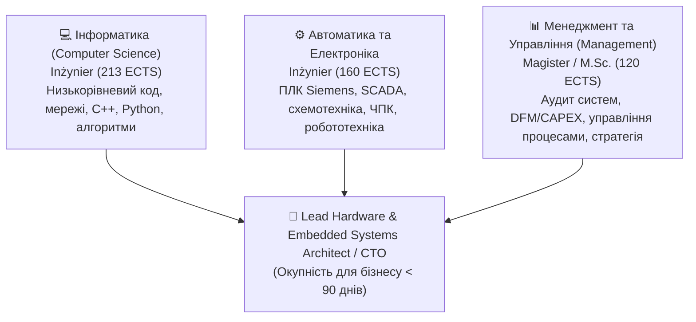

# 🎓 Академічний Фундамент та Дипломи: Роман Дейнеко

> **Локація папки:** `/Users/neko/Documents/PlatformIO/Projects/oleh-bachara-portfolio/privatInfo/study`  
> **Оригінальні документи:** Офіційні виписки USOSweb з Państwowa Akademia Nauk Stosowanych w Jarosławiu (PANS w Jarosławiu)  
> **Сумарний академічний обсяг:** **493 ECTS**, понад **1 600+ годин акредитованих виробничих практик та лабораторних робіт**.

---

## 🏛️ 1. Аналітичний Огляд Потрійної Компетенції (The Triple Competence)

Унікальність інженерного профілю Романа Дейнека полягає у рідкісному поєднанні трьох взаємодоповнюючих академічних ступенів та напрямів:

| Напрям / Спеціальність | Ступінь | Тривалість | ECTS | Ключові Дисципліни та Фокус | Документ |
| :--- | :--- | :--- | :--- | :--- | :--- |
| **1. Інформатика (Computer Science)** | **Inżynier (B.Sc. Eng.)** | 2019 – 2023 | **213** | Вбудовані системи, алгоритми, мережі, Python, .NET, бази даних, ОС, комп'ютерна логіка, 800h практики | [`01_transcript_informatyka.md`](01_transcript_informatyka.md) |
| **2. Автоматика та Практична Електроніка** | **Inżynier (B.Sc. Eng.)** | 2022 – 2026 | **160** | Системи автоматизації, ПЛК, SCADA, схемотехніка, шафи керування, електроприводи, вимірювання, мобільні роботи, 720h практики | [`02_transcript_automatyka.md`](02_transcript_automatyka.md) |
| **3. Менеджмент (Management)** | **Magister (M.Sc.)** | 2023 – 2025 | **120** | Аудит інтегрованих систем, управління процесами, фінансове планування, оцінка якості продукту, бізнес-симуляції, дипломна робота | [`03_transcript_zarzadzanie.md`](03_transcript_zarzadzanie.md) |

---

## 📑 2. Реєстр Файлів Папки `study/`

1. **[`01_transcript_informatyka.md`](01_transcript_informatyka.md)** — Повна виписка оцінок з комп'ютерних наук (програмування, теорія сигналів, паралельні обчислення, Python, архітектура систем).
   - Вихідний PDF: [`Transcript_of_records-informatyka.pdf`](Transcript_of_records-informatyka.pdf) (114.5 KB).
2. **[`02_transcript_automatyka.md`](02_transcript_automatyka.md)** — Повна виписка оцінок з автоматики та електроніки (проектування схем, шафи керування, промислові контролери, робототехніка, мікропроцесорна техніка).
   - Вихідний PDF: [`Transcript_of_records-automatyka.pdf`](Transcript_of_records-automatyka.pdf) (113.9 KB).
3. **[`03_transcript_zarzadzanie.md`](03_transcript_zarzadzanie.md)** — Повна виписка магістерських оцінок з менеджменту (аудит якості, стратегічний менеджмент, дипломний семінар [5.0], статистика, оптимізація виробничих процесів).
   - Вихідний PDF: [`Transcript_of_records-zarzandzanie.pdf`](Transcript_of_records-zarzandzanie.pdf) (113.0 KB).

---

## 💡 3. Чому це вирішальний аргумент для позиції 16 000 PLN / місяць?

На ринку праці Польщі та ЄС більшість кандидатів мають лише вузьку спеціалізацію:
- **Звичайний програміст (Full-Stack):** не розуміє фізики електричних кіл, не вміє читати електросхеми шаф керування і не знає ПЛК Siemens.
- **Класичний автоматик (PLC Engineer):** пише лише драбинну логіку (Ladder Logic) в TIA Portal, не знає сучасного вебу, асинхронного Python/FastAPI, WebSockets або Canvas.
- **Технічний менеджер (PM/Scrum):** часто не має глибокої інженерної підготовки у розробці "заліза" і не може особисто перевірити код або розрахувати допуски $\pm 0.05$ мм.

**Роман Дейнеко володіє всіма трьома вимірами одночасно:**
- Проєктує залізо та друковані плати (Inżynier Automatyk).
- Пише надійний вбудований та серверний софт (Inżynier Informatyk).
- Організовує виробничий процес, керує бюджетами та рахує окупність CAPEX/BOM (Magister Zarządzania).
